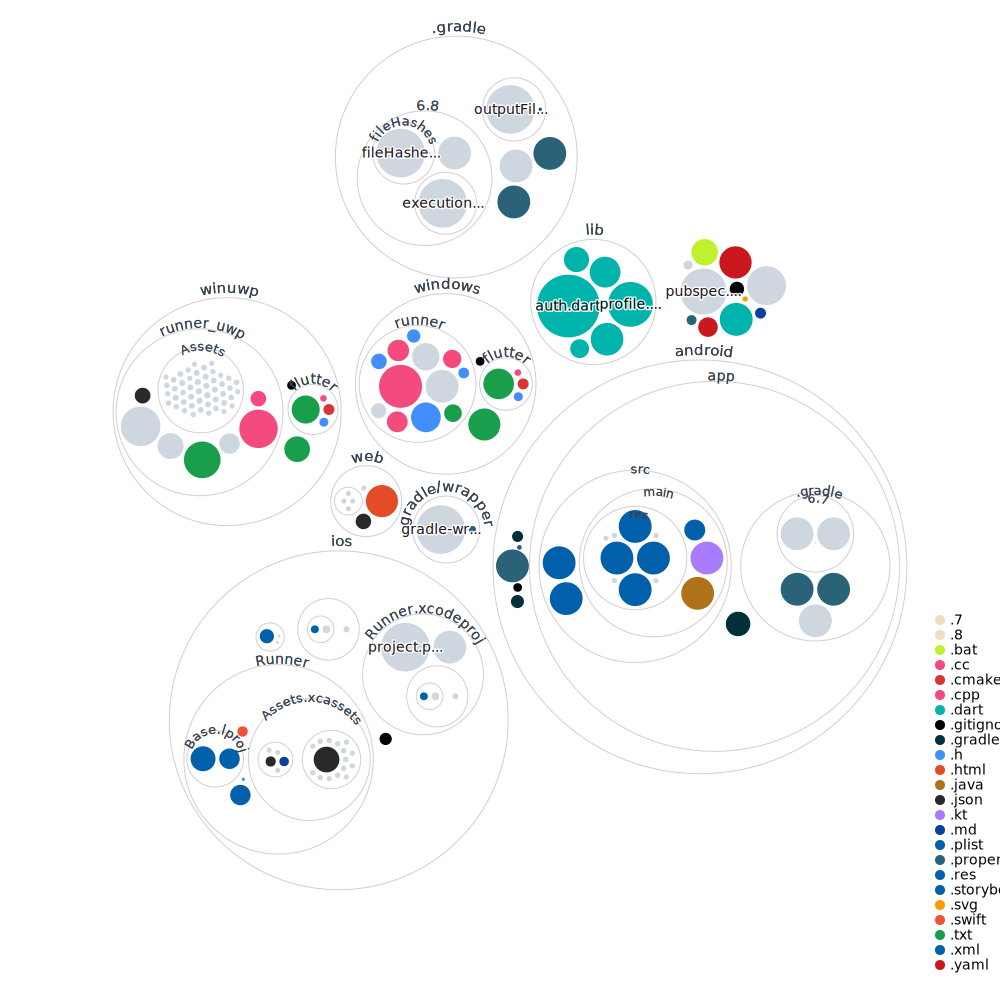

# BabyTrack IO

This is an Android and IOS to help Andrea and Marco track when their baby eats, poops and pees. Maybe the sleeping schedule too if I get fancy.

## Getting Started

Yeah lets get started.

```dart
flutter pub get
flutter run
```

Due to changes in some of the packages I now have to run it with no-null-safety:

```dart
flutter run --no-sound-null-safety      
```

## Repo Visualization
